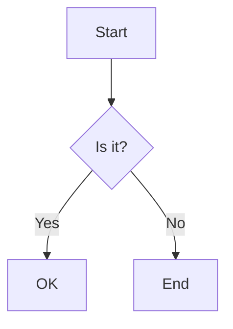

## 안녕하세요!

이것은 VS Code에서 작성한 첫 번째 Jekyll 글입니다.

## 서식 텍스트

**굵은 글씨입니다.**

*기울인 글씨입니다.*

<u>밑줄입니다.</u>

키보드 입니다! <kbd>Ctrl</kbd> + <kbd>C</kbd>

~~취소선입니다.~~

인라인 코드 가능합니다: `print("Hello")`

> 인용문 사용 가능합니다.
>> - 중첩도
>> - 됩니다.

구분선

---

- 순수 없는 목록
- 입니다

1. 순서 있는 목록
2. 입니다.

- [ ] 할 일 목록
- [x] 한 일 목록

정의 목록

Apple
: A fruit that is red.

강조 박스들

> 팁입니다.
> 
> 참고하세요.
{: .prompt-tip}

> 정보입니다.
> 
> 참고하세요.
{: .prompt-info}

> 주의 사항입니다.
> 
> 주의하세요.
{: .prompt-warning}

> 위험합니다.
> 
> 백업하세요.
{: .prompt-danger}

Mermaid 지원



## 수식 테스트

AI 연구에 필요한 수식 $x$도 잘 나옵니다.

$$
E = \begin{cases}
mc^2 & \text{if } A \\
\frac{1}{2} mv^2 & \text{o.w.}
\end{cases}
$$

## 코드 테스트

일반

```python
print("Hello, GitHub Pages!")
```

파일 경로 표시

```python
import torch
...
```
{: file="utils/data_loader.py"}

## 링크

[하이퍼링크](https://github.com/khhandrea)입니다.


_캡션입니다._